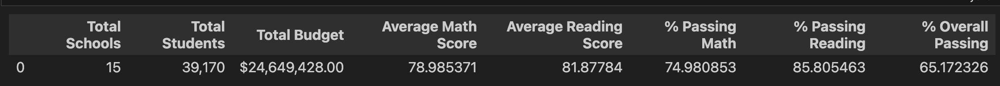
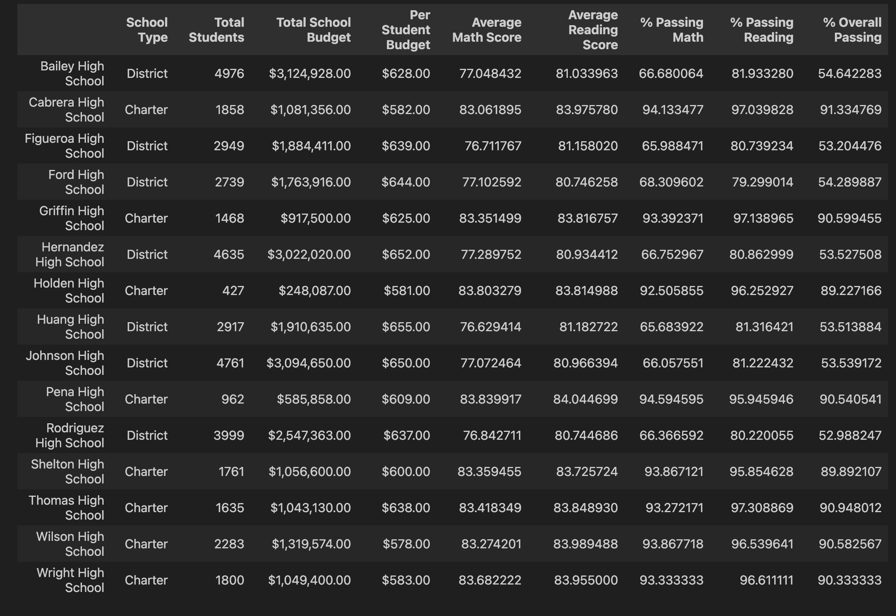
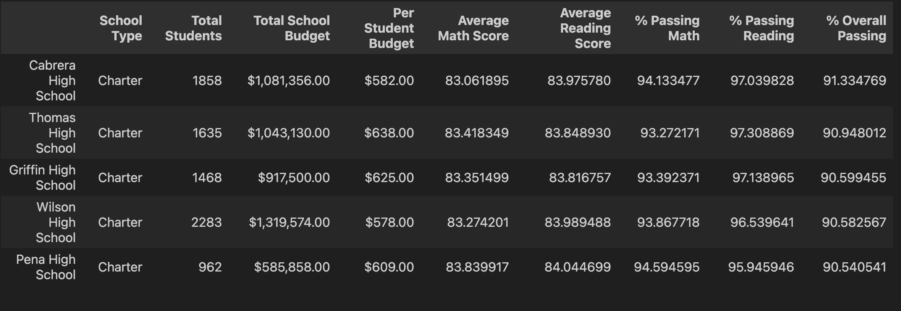
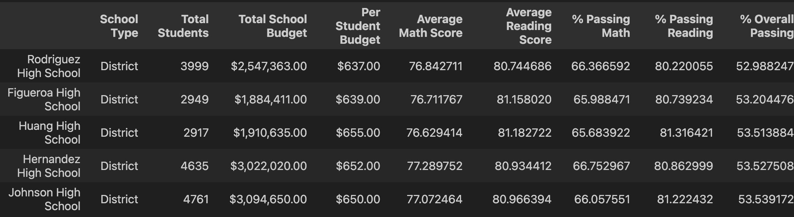
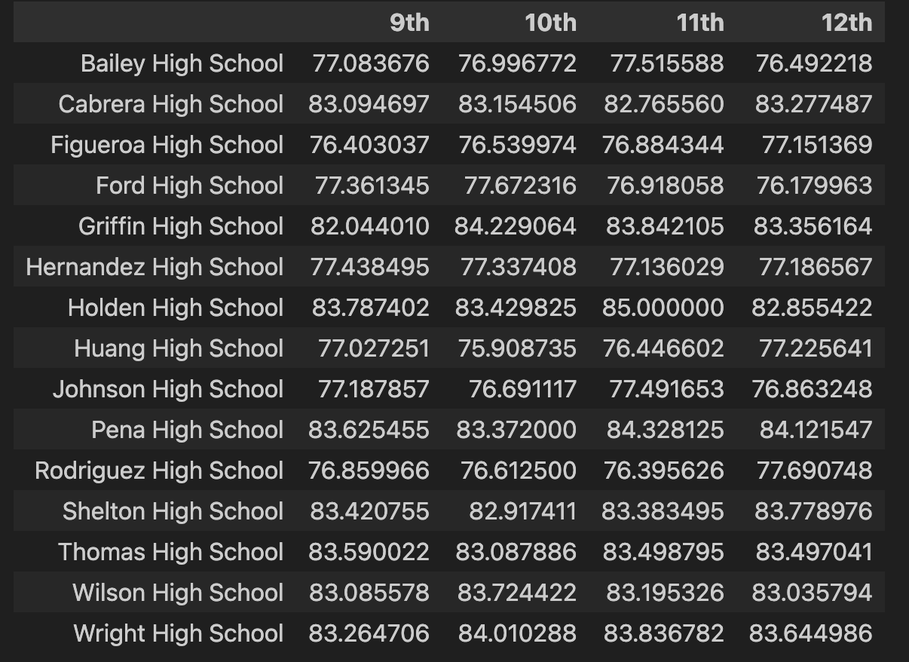
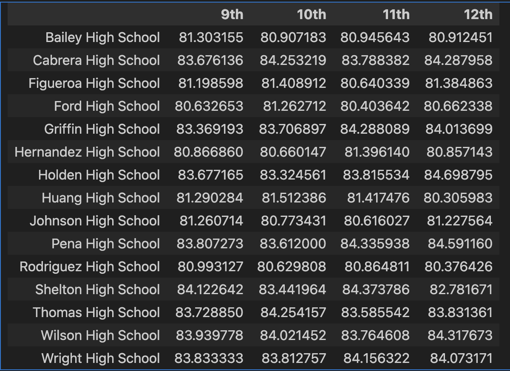
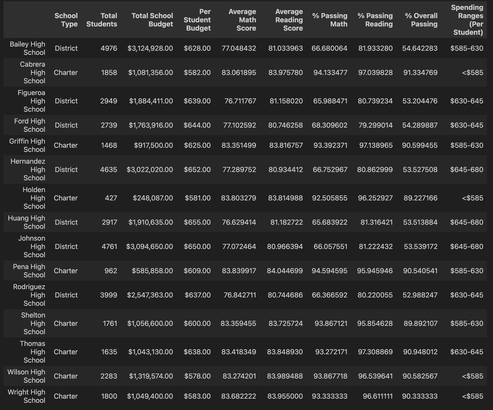
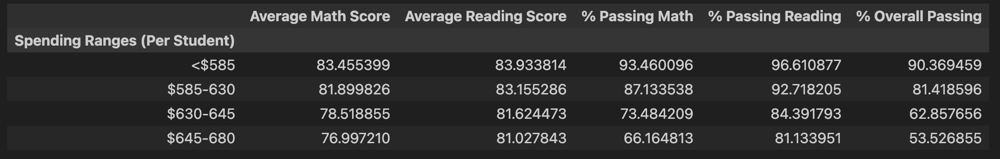
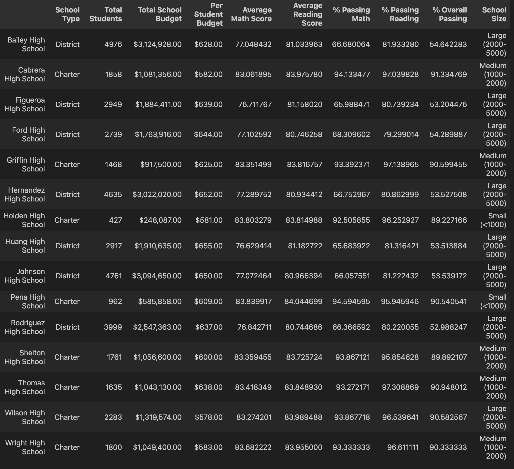
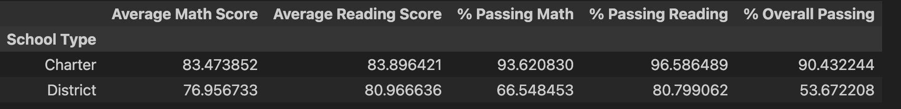

# pandas-challenge

A pandas project for analyzing a school district's data at school and district levels to give insights to trends about passing rates, school size, school type, and school budget.

## Table of Contents
#### Introduction
#### Requirements & Dependencies
#### Analysis and Results
#### Usage
#### Contributing
#### License

#### Introduction
This project uses a Jupyter Notebook (ipynb) script that uses pandas to analyze two csv files: school size and budget, student data including math and reading scores. The analysis yields summaries about relationships among school size, budget type, academic performance. Results and summaries are visualized in-line, consistent with ipynb files. 

#### Requirements & Dependencies
Python (version 3.10.9)
Pandas (version: 2.0.3)

#### Analysis
Two datasets were provided as csv files: 
- Schools data with columns "School ID", "school_name", "type", "size", and "budget". 
- Students data with columns: "Student ID", "student_name", "gender", "grade", "school_name", "reading_score",and "math_score".

The following results were generated:
##### 1. District Summary 
- Total number of unique schools
- Total students
- Total budget
- Average math score
- Average reading score
- % passing math (the percentage of students who passed math)
- % passing reading (the percentage of students who passed reading)
- % overall passing (the percentage of students who passed math AND reading)
###### Output

##### 2. Per School Summary
- School name

- School type

- Total students

- Total school budget

- Per student budget

- Average math score

- Average reading score

- % passing math (the percentage of students who passed math)

- % passing reading (the percentage of students who passed reading)

- % overall passing (the percentage of students who passed math AND reading)
###### Output

##### Highest-Performing Schools (by % Overall Passing)
###### Output

##### Lowest-Performing Schools (by % Overall Passing)
###### Output

##### Math Scores by Grade
###### Output

##### Reading Scores by Grade
###### Output

##### Scores by School Spending
###### Output

##### Spending Summary 
- Average math score

- Average reading score

- % passing math (the percentage of students who passed math)

- % passing reading (the percentage of students who passed reading)

- % overall passing (the percentage of students who passed math AND reading)
###### Output

##### Scores by School Size
###### Output

##### Scores by School Type
###### Output

#### Usage
Here's how to use the PyCitySchools Jupyter Notebook script:
- ##### Ensure that the CSV files contain the specified data in the appropriate format
- Schools data with columns: "School ID", "school_name", "type", "size", and "budget". 
- Students data with columns: "Student ID", "student_name", "gender", "grade", "school_name",

- ##### Distribute the code appropriately across Jupiter Notebook cells to display the desired tables

- ##### Run the code.
- The script will analyze the schools and student data and display tables in-line 

#### Contributing

Contributions to this projects are highly encouraged! If you wish to contribute, please follow these guidelines:

- Fork the respective repository for the PyCitySchools Jupyter Notebook script and clone it locally.
- Create a new branch for your feature or bug fix.
- Commit your changes with descriptive commit messages.
- Push your branch to your forked repository.
- Submit a pull request to the original repository.
- Please ensure that your code adheres to the project's coding style and conventions.

If you encounter any issues or have suggestions for improvements, please open an issue on the GitHub repository.

### License
These projects are licensed under the MIT License. Feel free to use, modify, and distribute the code as per the terms of the license. 
